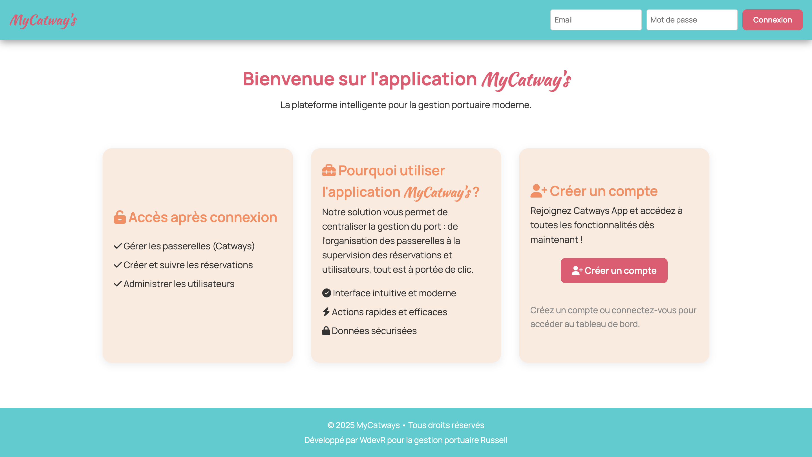
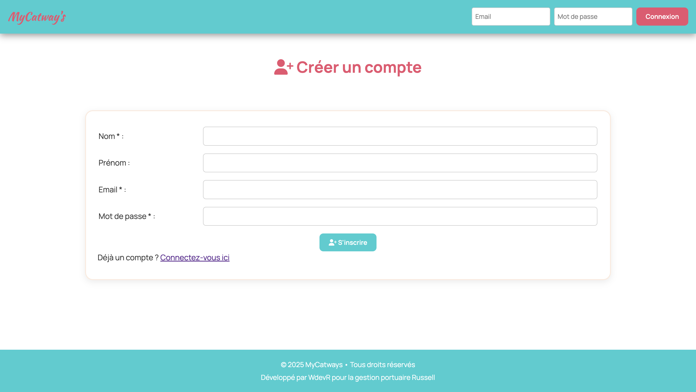
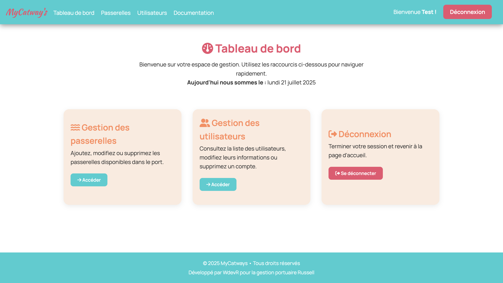
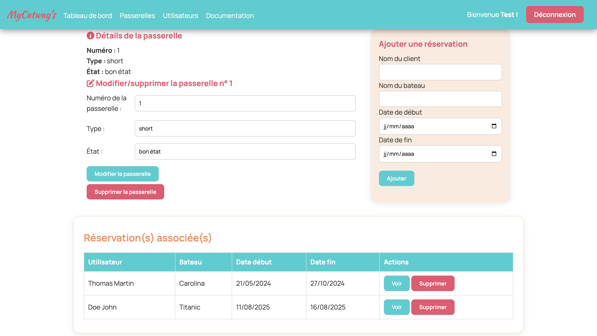

# 🚢 MyCatway's - Gestion de port et passerelles

Bienvenue dans **MyCatway's**, une application web de gestion de port maritime. Cette plateforme permet de gérer les passerelles, les utilisateurs, et les réservations via une interface intuitive.

---

## ✨ Fonctionnalités principales

* 🔐 Authentification avec JWT (connexion, inscription)
* 🛳️ Gestion des passerelles (ajout, modification, suppression)
* 👥 Gestion des utilisateurs (CRUD complet)
* 🗕️ Visualisation des réservations en cours
* 📲 Documentation intégrée de l’API
* 🧠 Interface responsive avec thème personnalisé

---
## 📸 Captures d’écran

### Page d'accueil


### Page de connexion


### Tableau de bord


### Détails d'une passerelle


---

## 🚀 Installation locale

### 🔧 Prérequis

* Node.js (v16+)
* MongoDB (en local ou via Atlas)

### ⚙️ Clonage et setup

```bash
git clone https://github.com/jeanniot-wdv/API_Russell.git
cd API_RUSSELL
npm install
```

### 🛠️ Configuration

Créer un dossier `env` avec un fichier `.env` à la racine avec :

```env
PORT=3000
MONGODB_URI=mongodb://localhost:27017/myport <--- votre lien vers mongoDb
SECRET_KEY=votre_clé_secrète
```

---

### ▶️ Lancement

```bash
npm start
```

L’application est accessible sur : [http://localhost:3000](http://localhost:3000)

---

## 📚 Documentation API

L’API est accessible depuis la route `/doc` : [http://localhost:3000/doc](http://localhost:3000/doc)

### Exemples de routes :

#### Authentification

* `POST /api/login` — Connexion
* `POST /api/users` — Inscription

#### Utilisateurs

* `GET /api/users` — Liste des utilisateurs
* `GET /api/users/:id` — Détails utilisateur
* `PUT /api/users/:id` — Modifier utilisateur
* `DELETE /api/users/:id` — Supprimer utilisateur

#### Passerelles (catways)

* `GET /api/catways` — Liste des passerelles
* `POST /api/catways` — Créer une passerelle
* `GET /api/catways/:id` — Détails
* `PUT /api/catways/:id` — Modifier
* `DELETE /api/catways/:id` — Supprimer

#### Réservations

* `GET /api/catways/:id/bookings` — Liste des réservations d'une passerelle
* `POST /api/catways/:id/bookings` — Nouvelle réservation
* `DELETE /api/catways/:id/bookings/:id` — Supprimer

---

## 🧪 Scripts utiles

| Commande       | Action                           |
| -------------- | -------------------------------- |
| `npm run dev`  | Démarre avec nodemon             |
| `npm test`     | Lancer les tests (si configurés) |
| `npm run seed` | Injecte des données de test      |

---

## 🙌 Contribution

Les contributions sont les bienvenues ! Merci de :

1. Créer une issue ou une pull request
2. Suivre les bonnes pratiques Git (`feat/`, `fix/`, `refactor/`, etc.)
3. Documenter clairement vos changements

---

### 👨‍💼 Auteur

Réalisé par [Romain](https://github.com/jeanniot-wdv)
